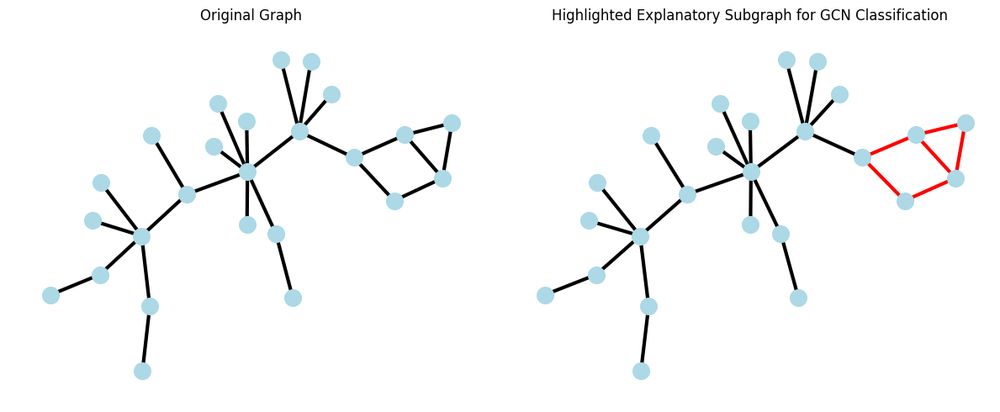

# Table of Contents

1. [Introduction](#introduction)
2. [Barabási-Albert (BA) Graph](#barabási-albert-ba-graph)
3. [Custom BA2MOTIF Dataset](#custom-ba2motif-dataset)
4. [Models](#models)
   - [Graph Convolutional Network (GCN) Classifier](#graph-convolutional-network-gcn-classifier)
   - [Graph Isomorphism Network (GIN) Classifier](#graph-isomorphism-network-gin-classifier)
   - [Fine-Tuning with Graph Perturbation](#fine-tuning-with-graph-perturbation)
5. [PGExplainer](#pgexplainer)
6. [Results and Discussion](#results-and-discussion)
   - [Recap of Model Performance](#recap-of-model-performance)
   - [Key Takeaways](#key-takeaways)

## Introduction

This report outlines the process of analyzing the BA2MOTIF dataset, creating a custom version from scratch, applying multiple classification models, fine-tuning, and using PGExplainer to highlight relevant subgraphs (motifs) for the classifications of a Graph Convolutional Network (GCN).

## Barabási-Albert (BA) Graph
<figure>
  
  <figcaption>Figure 1: Distribution of degrees in BA graph</figcaption>
</figure>

In a BA graph, nodes with more connections are more likely to form even more connections with new nodes of the graph. As a result, and as seen in Figure 1, few nodes have high degrees and most nodes have low degrees.

## Custom BA2MOTIF Dataset
<figure>
  
  <figcaption>Figure 2: House and cycle motif from custom BA2MOTIF dataset</figcaption>
</figure>

The BA2MOTIF dataset is a synthetic dataset of 1000 BA graphs with a motif attached to them. 500 graphs have an attached house motif and the other 500 have an attached cycle motif. A custom version of this dataset was created for educational purposes. The GNN classification task is to determine whether the BA2MOTIF graph contains a house or cycle motif, and the explanation task is to identify the primary subgraph responsible for the GNN classification.

In the custom BA2MOTIF dataset:
- Each BA2MOTIF graph has 20 non-motif nodes and 5 motif nodes
- The edge connecting the motif to the BA graph is between a randomly chosen BA graph node and a randomly chosen motif node.
- Node feature: nodes have one identical feature (set to 1);  this forces GNN to learn solely from graph structure
- Edge feature: 1 for motif edges (edge between two nodes in motif), 0 for non-motif edges; edge feature not used in GNN, but may later be used in evaluating explainer accuracy
- House BA2MOTIF graphs (BA graph with attached house motif) are labeled 1, and cycle BA2MOTIF graphs are labeled 0

## Models

### Graph Convolutional Network (GCN) Classifier
**Structure**
- 2 convolution layers and normalization layers
- Concatenation of max pool and mean pool for graph embedding
- MLP for classification

**Training**
- Number of epochs: 200
- Initial training: one train/validation split
- Highest validation accuracy: 99.38%
- Final model performance:
   - Train Accuracy: 99.84%
   - Test Accuracy: 100.00%

**Inference on Different Data**
- Successfully classified a house BA2MOTIF graph with 30 non-motif nodes (out-of-distribution) with 100% confidence

### Graph Isomorphism Network (GIN) Classifier
**Structure**
- 2 convolution layers with MLP in the aggregation function
   - Dropout in each MLP after activation in the first hidden layer
- Concatenation of mean and max pooling for graph embedding
- Final MLP classification layer

**Training**
- Number of epochs: 100
- Initial training: one train/validation split
- Highest validation accuracy: 98.50%
- Final model performance:
   - Train Accuracy: 99.22%
   - Test Accuracy: 99.50%

### Fine-Tuning With Graph Perturbation
To improve the trained GIN's performance:

- Froze parameters of all layers except the final MLP classification layer (whose parameters were reinitialized)
- Fine-tuned GIN with an augmented BA2MOTIF dataset (augmentations included node feature masking, edge perturbations) for 30 epochs

Improved Results
- Train Accuracy: 99.38%
- Test Accuracy: 100.00%

## PGExplainer
- PGExplainer is used to weigh edges by their importance in the trained GCN's classifications. PGExplainer outputs a weighted edge mask, where each value (between 0 and 1) of the edge mask indicates the importance of that edge in the GCN's decision.

### Training
- The loss function for the training process involved multiple components, which relate to trainable weighted edge mask of PGExplainer.

- Loss function components:
   - Difference between normal GCN classification and GCN classification with weighted edge mask applied to graph (i.e. original graph with weighted message passing)
   - Regularization coefficients to minimize size of explanation and to encourage discreteness in the edge weights 

<figure>
  
  <figcaption>Figure 3: Total loss per epoch during PGExplainer training</figcaption>
</figure>

- Approximately 40 epochs of training appeared to minimize the loss well without overfitting

### Inference
- After training PGExplainer, graphs from the custom BA2MOTIF dataset were fed into both the GCN classifier and PGExplainer. The outputted edge mask of PGExplainer was used to create a visualization of the proposed explanatory subgraph. This was done by looking at the k (a parameter) most important edges, and highlighting the largest subgraph formed from these edges. The explanatory subgraph, highlighted in red, should be the attached motif (house or cycle). Sample inputs from the test dataset and the resulting explanatory subgraphs from PGExplainer are shown below.

#### Cycle Motif

<figure>
  
  <figcaption>Figure 4: PGExplainer highlights explanatory subgraph of cycle BA2MOTIF graph</figcaption>
</figure>

This graph from the custom BA2MOTIF dataset is correctly classified by the GCN as having a cycle motif. Additionally, PGExplainer properly identifies the explanatory subgraph.

#### House Motif

<figure>
  
  <figcaption>Figure 5: PGExplainer highlights explanatory subgraph of house BA2MOTIF graph</figcaption>
</figure>

This graph from the custom BA2MOTIF dataset is correctly classified by the GCN as having a house motif. Additionally, PGExplainer properly identifies the explanatory subgraph.

Overall, PGExplainer correctly identifies the explanatory subgraph for the GCN classifier's decision for nearly all samples in the dataset. Based on manual classification, the train and test accuracies are expected to exceed 90%.

## Results and Discussion
### Recap of Model Performance

1. GCN Classifier
- **Train Accuracy**: 99.84%
- **Test Accuracy**: 100.00%

2. GIN (Initial):
- **Train Accuracy**: 99.22%
- **Test Accuracy**: 99.50%

3. GIN (Fine-tuned)
- **Train Accuracy**: 99.38%
- **Test Accuracy**: 100.00%

4. PGExplainer
- Overall train and test accuracies have not yet been evaluated, but based on manual classification, they are expected to exceed 90%.

### Key Takeaways

- Both GCN and GIN perform exceptionally well in classifying the BA2MOTIF dataset
- Fine-tuning with graph perturbations improved the GIN's performance to match that of the GCN
- PGExplainer properly explains the classifications made by the GCN

### Future Plans
- Evaluate the PGExplainer accuracy against ground truth labels for motif edges