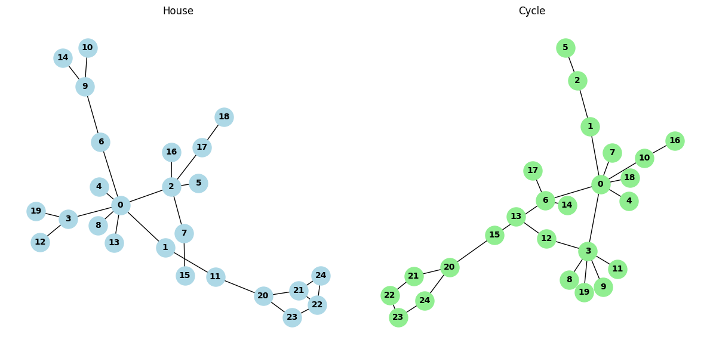

# Table of Contents

1. [Introduction](#introduction)
2. [Barabási-Albert (BA) Graph](#barabási-albert-ba-graph)
3. [BA2MOTIF Dataset](#ba2motif-dataset)
4. [Models](#models)
   - [Graph Convolutional Network (GCN) Classifier](#graph-convolutional-network-gcn-classifier)
   - [Graph Isomorphism Network (GIN) Classifier](#graph-isomorphism-network-gin-classifier)
   - [Fine-Tuning with Graph Perturbation](#fine-tuning-with-graph-perturbation)
5. [PGExplainer](#pgexplainer)
6. [Results and Discussion](#results-and-discussion)
   - [Recap of Model Performance](#recap-of-model-performance)
   - [Key Takeaways](#key-takeaways)

## Introduction

This report outlines the process of analyzing the BA2MOTIF dataset, creating a custom version from scratch, applying multiple classification models, fine-tuning, and using PGExplainer to extract relevant subgraphs (motifs) in the classification of the fine-tuned Graph Isomorphism Network (GIN).

## Barabási-Albert (BA) Graph
<figure>
  
  <figcaption>Figure 1: Distribution of degrees in BA graph</figcaption>
</figure>

In a BA graph, nodes with more connections are more likely to form even more connections with new nodes of the graph. As a result, and as seen in Figure 1, few nodes have high degrees and most nodes have low degrees.

## BA2MOTIF Dataset
<figure>
  
  <figcaption>Figure 2: Different motifs in BA2MOTIF dataset</figcaption>
</figure>

The BA2MOTIF dataset is a synthetic dataset of 1000 BA graphs with a motif attached to them. 500 graphs have a house motif and the other 500 have a cycle motif. A custom version of the dataset was created for use in classification and explanation models. In the custom version:
- Each BA2MOTIF graph has 20 non-motif nodes and 5 motif nodes
- The nodes are sequentially numbered, with the base graph nodes numbered 0-19 and the motif nodes numbered 20-24
   - Purely for internal data organization; not used as a feature in the classification task to ensure fair and unbiased learning
- The classification task is to determine whether the attached motif is a house (1) or a cycle (0)

## Models

### Graph Convolutional Network (GCN) Classifier
**Structure**
- 2 convolution layers and normalization layers
- Concatenation of max pool and mean pool for graph embedding
- MLP for classification

**Training**
- Number of epochs: 200
- Initial training: one train/validation split
- Highest validation accuracy: 99.38%
- Final model performance:
   - Train Accuracy: 100%
   - Test Accuracy: 100%

**Inference on Different Data**
- Tested on a BA2MOTIF graph with 30 non-motif nodes (out-of-distribution)
- Successfully predicted a cycle motif with 95.85% confidence

### Graph Isomorphism Network (GIN) Classifier
**Structure**
- 2 convolution layers with MLP in the aggregation function
   - Dropout in each MLP after activation in the first hidden layer
- Concatenation of mean and max pooling for graph embedding
- Final MLP classification layer

**Training**
- Number of epochs: 100
- Initial training: one train/validation split
- Highest validation accuracy: ~98.5%
- Final model performance:
   - Train Accuracy: 99.38%
   - Test Accuracy: 99.50%

### Fine-Tuning With Graph Perturbation
To improve the trained GIN's performance:

- Froze parameters of all layers except the final MLP classification layer
- Fine-tuned on an augmented BA2MOTIF dataset for 20 epochs
- Augmentations included node feature masking and edge perturbations

Improved Results
- Train Accuracy: 99.69%
- Test Accuracy: 100.00%

## PGExplainer
- PGExplainer was used to extract relevant subgraphs that contributed to the fine-tuned GIN's predictions

## Implementation

### Inference
- After training PGExplainer, graphs from the custom BA2MOTIF dataset were inserted into both the GIN classifier and PGExplainer
- Originally, PGExplainer performed very poorly, extracting the incorrect subgraph for all the graphs tested
- After discovering PGExplainer consistently confused the most important edges for the least edges, the `plotting.py` module was altered to pick the least important edges from the subgraph and plot them

<figure>
  
  <figcaption>Figure 3: BA2MOTIF graph fed into PGExplainer</figcaption>
</figure>

This graph from the custom BA2MOTIF dataset was correctly classified by the fine-tuned GIN as having a house motif.
<figure>
  
  <figcaption>Figure 4: PGExplainer's explanation of Figure 3</figcaption>
</figure>

As a result of this temporary fix, PGExplainer correctly identifies the subgraph that led to the GIN classifier's decision for nearly all samples in the dataset when tested individually. More important edges are colored dark grey, while less important edges are light grey.

## Results and Discussion
### Recap of Model Performance

1. GCN Classifier
- **Train Accuracy**: 100.00%
- **Test Accuracy**: 100.00%

2. GIN (Initial):
- **Train Accuracy**: 99.38%
- **Test Accuracy**: 99.50%

3. GIN (Fine-tuned)
- **Train Accuracy**: 99.69%
- **Test Accuracy**: 100.00%

4. PGExplainer
- Overall accuracy cannot be currently evaluated due to lack of ground truth labels for motif edges
- It is suspected that the explainer identifies the most important edges for the correct class as the least important for detecting the other class, which may lead to incorrect explanations

### Key Takeaways

- The BA2MOTIF dataset is a common benchmark for evaluating graph explainers
- Both GCN and GIN perform exceptionally well in classifying the BA2MOTIF dataset
- Fine-tuning with graph perturbations improved the GIN's performance to match that of the GCN
- PGExplainer, when the fix described above applied, properly justifies the classifications made by the fine-tuned GIN

### Future Work
- [In Progress] Investigate why PGExplainer made decision to identify important edges as the least important
- [In Progress] Evaluate the PGExplainer's accuracy against ground truth labels for motif edges