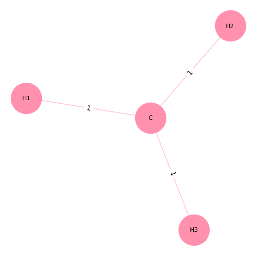
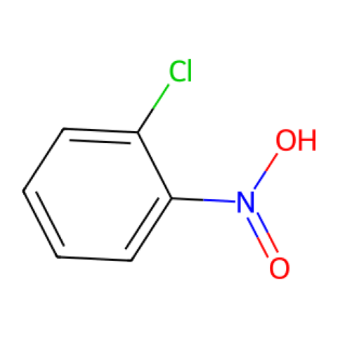

# Table of Contents

1. [Introduction](#introduction)
2. [Graph Representations](#graph-representations)
   - [Matrix Representation](#matrix-representation)
   - [Dictionary Representation](#dictionary-representation)
3. [MUTAG Dataset](#mutag-dataset)
4. [Graph Isomorphism Network (GIN)](#graph-isomorphism-network-gin)
5. [Results and Discussion](#results-and-discussion)
   - [Model Performance](#model-performance)
   - [Key Takeaways](#key-takeaways)

## Introduction

This report outlines the process of creating graph representations from scratch and implementing a Graph Isomorphism Network (GIN) classifier for the MUTAG dataset. The classifier aims to classify molecules as mutagenic or non-mutagenic based on their graph structure.

## Graph Representations
To gain a deeper understanding of graph structures, two different graph representations were implemented from scratch.

### Matrix Representation

Matrix representation of graphs, used in PyTorch, can be found in detail in pages 3–4 of `notes.pdf`.

<figure>
  
  <figcaption>Figure 1: Methyl Representation with Underlying Dynamic Matrix Structure</figcaption>
</figure>

A molecular graph class with the following underlying matrices was implemented: adjacency matrix, edge index matrix, node feature matrix, and edge feature matrix. Additionally, it included a dictionary for graph level attributes.

Two versions were implemented:
- Static matrices: Predetermined matrix sizes
- Dynamic matrices: nodes/atoms could be added after instantiation of graph class

### Dictionary Representation
Dictionary representation of graphs, used in NetworkX, can be found in detail in pages 5–6 of `notes.pdf`.

A molecular graph class was implemented with dictionaries representing the following: graph attributes, nodes and their attributes, as well as edges and their attributes.

## MUTAG Dataset
<figure>
  
  <figcaption>Figure 2: Molecule from the MUTAG Dataset</figcaption>
</figure>

The MUTAG dataset consists of 188 mutagenic molecules, and the task is to classify whether a molecule has a mutagenic effect on a specific type of bacteria.

## Graph Isomorphism Network (GIN)
**Structure**
- 2 convolution layers with MLP in the aggregation function
   - The number of neurons in the MLP aggregation function was optimized based on validation accuracy
- Concatenation of mean and max pooling for graph embedding
- Final MLP classification layer

### Training
- A single train/validation split was used for hyperparameter tuning
- Best validation accuracy achieved: 80.00%
- After achieving the highest validation accuracy possible with the best found hyperparameters, the model was retrained on the full training dataset

## Results and Discussion

### Model Performance

- **Final Train Accuracy**: 93.33%
- **Final Test Accuracy**: 86.84%

### Key Takeaways

- Explored various graph representations, including matrix and dictionary-based approaches
- With MUTAG dataset, GIN requires careful hyperparameter tuning for optimal results
- The use of a single train/validation split rather than k-fold cross validation may have caused some noise in model evaluation during hyperparameter tuning
